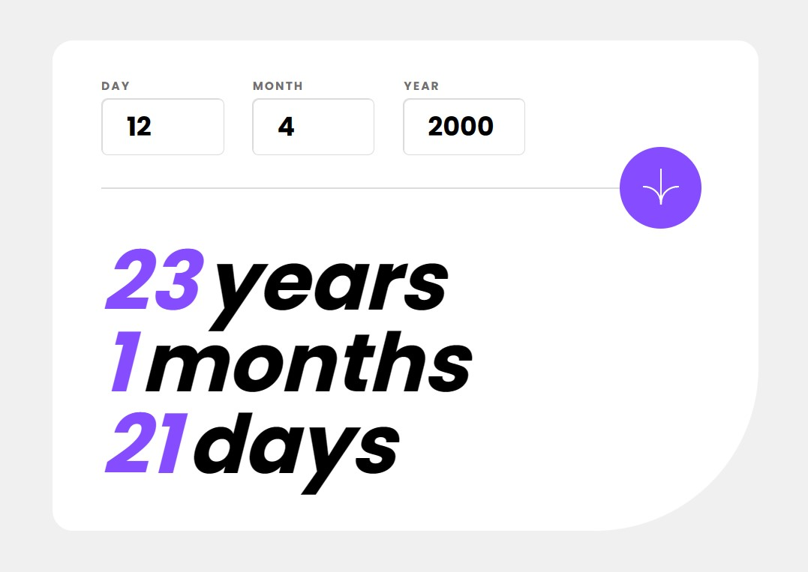

# Frontend Mentor - Age calculator app solution

This is a solution to the [Age calculator app challenge on Frontend Mentor](https://www.frontendmentor.io/challenges/age-calculator-app-dF9DFFpj-Q). Frontend Mentor challenges help you improve your coding skills by building realistic projects.

## Table of contents

- [Overview](#overview)
  - [The challenge](#the-challenge)
  - [Screenshot](#screenshot)
  - [Links](#links)
- [My process](#my-process)
  - [Built with](#built-with)
  - [What I learned](#what-i-learned)
  - [Continued development](#continued-development)
- [Author](#author)

## Overview

### The challenge

Users should be able to:

- View an age in years, months, and days after submitting a valid date through the form
- Receive validation errors if:
  - Any field is empty when the form is submitted
  - The day number is not between 1-31
  - The month number is not between 1-12
  - The year is in the future
  - The date is invalid e.g. 31/04/1991 (there are 30 days in April)
- View the optimal layout for the interface depending on their device's screen size
- See hover and focus states for all interactive elements on the page
- See the age numbers animate to their final number when the form is submitted

### Screenshot

### Links

- Solution URL: [https://www.frontendmentor.io/solutions/age-calculator-app-using-vue-and-sass-C7xcGrOAwo]
- Live Site URL: [https://leqsar.github.io/age-calculator/]

## My process

### Estimated time

4 hours

### Actual time

6 hours

### Built with

- Semantic HTML5 markup
- Flexbox
- [Vue](https://vuejs.org/) - Vue framework
- [SASS](https://sass-lang.com/)
- [GSAP](https://greensock.com/gsap/)
- [Vite](https://vitejs-dev.translate.goog/?_x_tr_sl=en&_x_tr_tl=ru&_x_tr_hl=ru&_x_tr_pto=sc)

### What I learned

- Basics of VUE
  - emit
  - single page component
  - computed properties
  - methods
- A little bit of basics of GSAP
- Reminded myself how to work with SASS

### Continued development

I'll stick to learning VUE. There is still a lot of info I don't know. In the closest future i want to develop app with API requests using VUE.
Also I want to create some more complicated animations using GSAP.

## Author

- Frontend Mentor - [@leqsar](https://www.frontendmentor.io/profile/yourusername)

